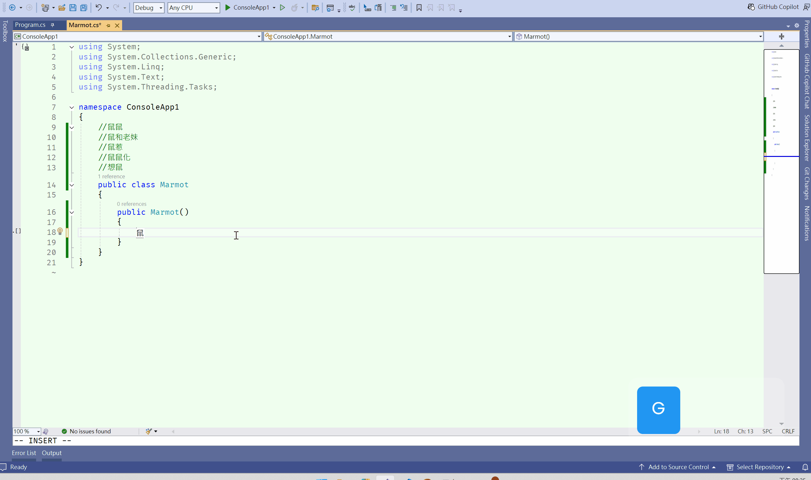



# Marmot Hippie Completion

**A tribute to the classic `Hippie Completion`!** This is a fast completion tool built for Visual Studio 2022, designed to replicate the beloved **"Cyclic Expand Word"** feature found in the IntelliJ IDEA / JetBrains series.

It automatically scans the words that have appeared in your current file, allowing you to quickly complete text with a simple keystroke—no heavy IntelliSense indexing required.

---

## 🚀 Key Features

* **Cyclic Expansion**: Automatically extracts words from the text buffer and cycles through matches.
* **Forward & Backward**: Support for both forward (`Alt + /`) and backward (`Shift + Alt + /`) cycling to find the right word faster.
* **Distance Priority**: Prioritizes words closer to the cursor, making it smarter and more intuitive.
* **Blazing Fast**: Powered by pure string-matching logic with zero CPU overhead. 

## ⌨️ Default Shortcuts

* **Forward Cycle**: `Alt + /`
* **Backward Cycle**: `Shift + Alt + /`

---

## ⚠️ Resolving Shortcut Conflicts

In Visual Studio, the default keys for these commands are often occupied by GitHub Copilot or built-in editor commands. If the shortcuts do not respond, please follow these steps:

### 1. Remove Conflicting Bindings
1. Go to **Tools** > **Options**.
2. Navigate to **Environment** > **Keyboard**.
3. Search for the following commands and click **Remove**:
   * **`Ask.Copilot`** (typically occupies `Alt + /`)
   * **`Edit.MoveLastCaretDown`** (typically occupies `Shift + Alt + /`)

### 2. Assign the Shortcuts to Marmot
1. Still in the **Keyboard** settings page, search for: `Marmot`.
2. For **Forward**:
   * Select `Edit.MarmotCyclicExpand`.
   * Set "Use new shortcut in" to **Text Editor**.
   * Press **`Alt + /`** and click **Assign**.
3. For **Backward**:
   * Select `Edit.MarmotCyclicExpandBackward`.
   * Set "Use new shortcut in" to **Text Editor**.
   * Press **`Shift + Alt + /`** and click **Assign**.

---

# Marmot Hippie Completion (中文版)

**致敬經典的 `Hippie Completion`！** 這是一款為 Visual Studio 2022 打造的快速補全工具，旨在復刻 IntelliJ IDEA / JetBrains 系列中深受開發者喜愛的「循環單字展開 (Cyclic Expand Word)」功能。

它可以自動掃描當前檔案中出現過的文字，讓您透過簡單的按鍵快速補全，無需依賴繁重的 IntelliSense 索引。

---

## 🚀 主要功能

* **循環補全 (Cyclic Expand)**：自動提取文字緩衝區中的單字，並依序進行循環替換。
* **雙向切換**：支援正向 (`Alt + /`) 與反向 (`Shift + Alt + /`) 循環，找尋單字更快速。
* **距離優先**：優先顯示離游標最近的匹配項，符合開發直覺。
* **極速體驗**：純字串匹配邏輯，不佔用 CPU 資源，即按即出。

## ⌨️ 預設快捷鍵

* **正向循環**：`Alt + /`
* **反向循環**：`Shift + Alt + /`

---

## ⚠️ 解決快捷鍵衝突

在 Visual Studio 中，預設的快捷鍵可能被 GitHub Copilot 或內建指令佔用。若按下按鍵沒有反應，請依照以下步驟手動重新指派：

### 1. 移除衝突的佔用
1. 前往 **工具 (Tools)** > **選項 (Options)**。
2. 導航至 **環境 (Environment)** > **鍵盤 (Keyboard)**。
3. 在搜尋框中找到以下指令並點擊 **移除 (Remove)**：
   * **`Ask.Copilot`** (通常佔用 `Alt + /`)
   * **`Edit.MoveLastCaretDown`** (通常佔用 `Shift + Alt + /`)

### 2. 指派給 Marmot
1. 仍在 **鍵盤 (Keyboard)** 設定頁面中，搜尋：`Marmot`。
2. **正向循環**：
   * 選中 `Edit.MarmotCyclicExpand`。
   * 將「新快速鍵用於」設定為 **文字編輯器 (Text Editor)**。
   * 按下 **`Alt + /`** 並點擊 **指派 (Assign)**。
3. **反向循環**：
   * 選中 `Edit.MarmotCyclicExpandBackward`。
   * 將「新快速鍵用於」設定為 **文字編輯器 (Text Editor)**。
   * 按下 **`Shift + Alt + /`** 並點擊 **指派 (Assign)**。
